# Northwind Sales Analysis | Power BI


An end-to-end sales and operations analysis built in **Power BI Desktop** using the Northwind sample database. The project was created as a portfolio case study to demonstrate intermediate Power BI skills aligned with the **Microsoft PL-300** competency areas: data preparation, semantic modeling, DAX, interactive reporting, security, and performance analysis.

## Project Overview

The report transforms relational Northwind data into an interactive analytical solution for monitoring sales, products, customers, employees, and order operations. It combines a dimensional model with explicit DAX measures and guided report navigation so users can move from an executive overview to detailed product-level analysis.

### Business Questions

- How are net sales and order volumes evolving over time?
- Which products and categories generate the most sales and units?
- Who are the highest-value customers, and where are they located?
- How does employee activity compare across sales and orders?
- How do discounts, discontinued products, and shipping activity affect the business view?
- Can users move from summary KPIs to a contextual product analysis without losing filter context?

## Report Highlights

- **Net Sales:** $448.4M
- **Orders:** 16K+
- **Units Sold:** 15M+
- **Customers:** 93
- **Employees:** 9
- Dynamic year and country filtering
- Top N product selection
- Year-over-year and previous-month comparisons
- YTD and three-month rolling calculations
- Drill-through and custom report-page tooltips
- Row-level security roles
- Performance Analyzer validation

> Values shown in the report belong to the extended Northwind sample dataset used in this project. Northwind is demonstration data; results should not be interpreted as the performance of a real company.

## Dashboard Pages

### 1. Executive Summary

The landing page provides a high-level view of sales performance. KPI cards summarize net sales, new customers, total orders, and units sold. Supporting visuals show the monthly sales trend, geographic distribution, category performance, leading products, and top customers. Year and country slicers, reset controls, and page-navigation buttons support quick exploration.

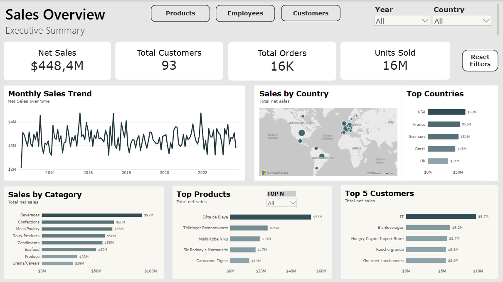

**What this page demonstrates**

- Executive KPI design and visual hierarchy
- Cross-filtering by year and country
- Geographic analysis with map visualization
- Dynamic Top N product analysis
- Navigation between report sections
- Consistent formatting and reusable reset-filter controls

### 2. Products and Categories

This page evaluates product performance through net sales, units sold, product ranking, discount information, category drill-down, discontinued-product monitoring, and monthly versus YTD sales. It combines detailed tables with comparative visuals to support both summary and item-level analysis.

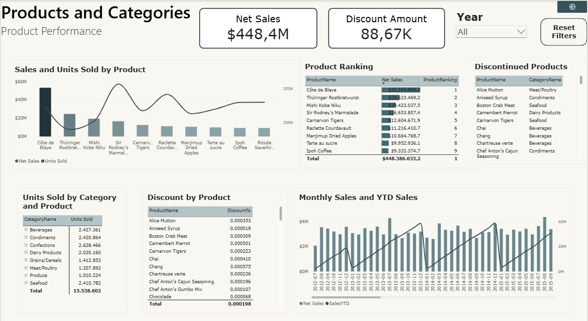

**What this page demonstrates**

- Dynamic product ranking with `RANKX`
- Top N filtering driven by a report parameter
- Hierarchical analysis from category to product
- Comparison of sales and units sold
- Identification of discontinued products
- Time-intelligence analysis with monthly and YTD results

### 3. Customers and Geography

The customer page combines commercial and geographic perspectives. It compares customers by sales and order volume, shows customer distribution by country, explores the relationship between order behavior and sales, and presents year-over-year customer performance in a conditionally formatted table.

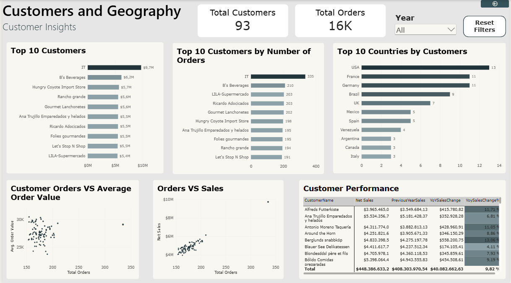

**What this page demonstrates**

- Customer comparison by value and activity
- Geographic distribution and country-level comparison
- Scatter plots for relationship and outlier analysis
- Previous-year sales and YoY measures
- Conditional formatting in a performance table
- Filter-aware customer metrics

### 4. Employees and Operations

This page compares sales and order activity across nine employees. It includes employee rankings, a three-month rolling average, cumulative sales, and orders shipped over time. A year slicer allows the user to evaluate workforce and operational patterns for a selected period.

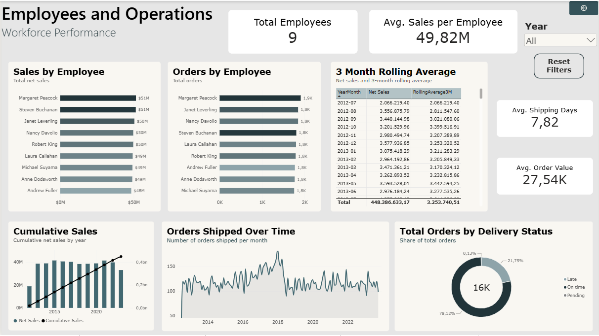

**What this page demonstrates**

- Employee-level KPI and ranking analysis
- Cumulative and rolling calculations
- Operational analysis based on shipping dates
- Use of alternate date relationships
- Time-based filtering and reusable navigation controls

## Product Drill-through

Users can right-click a product in the Top Products visual and navigate to a dedicated detail page. The drill-through action transfers the selected product context to the destination page.

<details>
<summary><strong>View drill-through action</strong></summary>

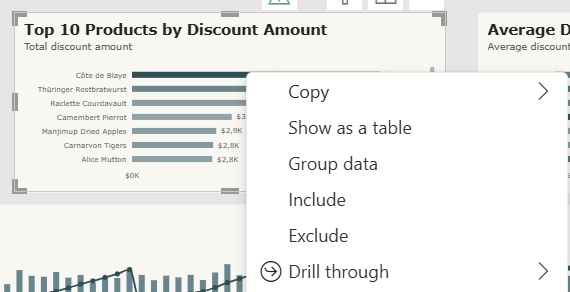

</details>

The Product Detail page shown below is filtered to **Côte de Blaye**, in the **Beverages** category. It displays the selected product, category, and supplier together with net sales, gross sales, discount amount, and units sold. The page also analyzes monthly sales, sales by country, gross versus net sales, and year-over-year product performance.

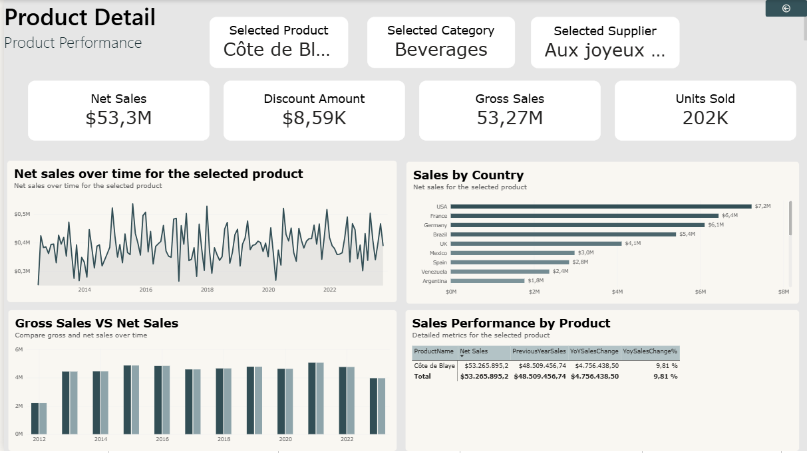

This feature demonstrates contextual navigation, filter propagation, detailed KPI design, and a return button for guided report usage.

## Custom Report-page Tooltip

A custom tooltip enriches the Top Products visual with additional measures without adding permanent objects to the main canvas. Hovering over a product displays contextual **Net Sales** and **Units Sold** values; the example shown reports approximately **$53.3M** and **202K units** for the selected product.

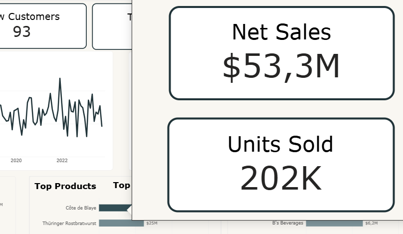

## Data Preparation with Power Query

Data was imported from the Northwind SQLite database and shaped in Power Query before being loaded into the semantic model. The solution contains 13 queries, including fact tables, dimensions, and source/helper queries.

The `FactSales` transformation shown below includes steps for:

- Removing unnecessary columns
- Expanding related order data
- Replacing values
- Renaming fields
- Assigning appropriate data types
- Creating custom business columns
- Preparing gross sales, discount amount, and net sales fields
- Removing final technical columns before load

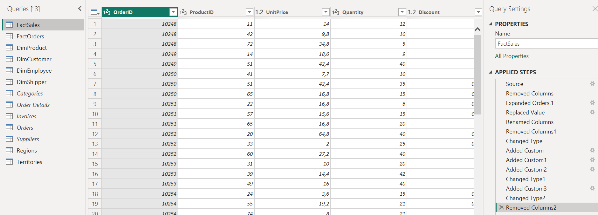

Source and helper queries are retained for transformation logic, while the report-facing fact and dimension tables provide a clearer analytical structure.

## Semantic Data Model

The model separates descriptive dimensions from fact-oriented tables:

- **FactSales:** sales-line metrics such as quantity, discount, gross sales, discount amount, and net sales
- **FactOrders:** order and delivery attributes used for operational analysis
- **DimProduct:** product, category, supplier, and discontinuation attributes
- **DimCustomer:** customer and geographic attributes
- **DimEmployee:** employee and organizational attributes
- **DimShipper:** shipping-provider attributes
- **DimDate:** calendar attributes for time intelligence

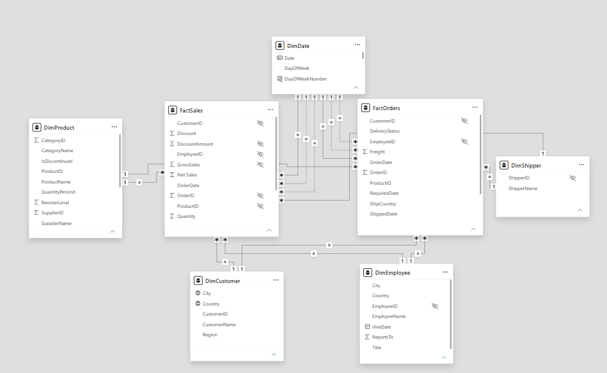

The model uses one-to-many relationships from dimensions to facts. Multiple date relationships support analysis by order, required, and shipped dates; inactive relationships are activated in measures when an alternative date context is required.

## DAX Measures

The report uses explicit DAX measures for KPIs, filter-context manipulation, time intelligence, ranking, scenario comparison, and operational analysis.

### Customer Share by Country

`Customers % of Total` divides the distinct customer count in the current country context by the customer count with the country filter removed. Other applicable report filters remain in context.

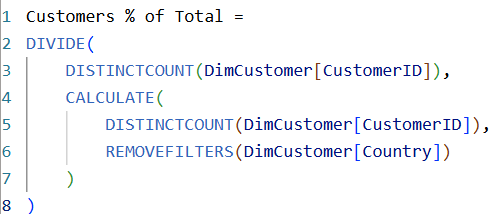

```DAX
Customers % of Total =
DIVIDE(
    DISTINCTCOUNT(DimCustomer[CustomerID]),
    CALCULATE(
        DISTINCTCOUNT(DimCustomer[CustomerID]),
        REMOVEFILTERS(DimCustomer[Country])
    )
)
```

### 3-Month Rolling Average

`RollingAverage3M` calculates the average net sales for the current month and the previous two months, smoothing short-term fluctuations to provide a clearer view of the sales trend.

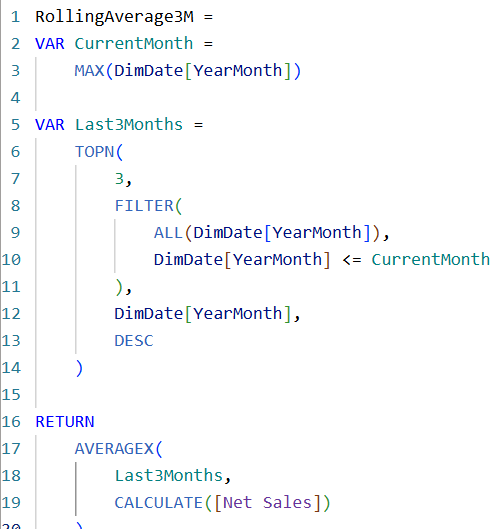

```DAX
RollingAverage3M =
VAR CurrentMonth =
    MAX(DimDate[YearMonth])

VAR Last3Months =
    TOPN(
        3,
        FILTER(
            ALL(DimDate[YearMonth]),
            DimDate[YearMonth] <= CurrentMonth
        ),
        DimDate[YearMonth],
        DESC
    )

RETURN
    AVERAGEX(
        Last3Months,
        CALCULATE([Net Sales])
    )
```

### Dynamic Product Ranking

`ProductRanking` ranks products by net sales in descending order. `ALL(DimProduct[ProductName])` removes the product-name filter while preserving other relevant filters, and `DENSE` avoids gaps between tied positions.

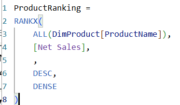

```DAX
ProductRanking =
RANKX(
    ALL(DimProduct[ProductName]),
    [Net Sales],
    ,
    DESC,
    DENSE
)
```

### Top N Visual Filter

`Show Product` compares the dynamic product rank against the selected Top N parameter. The measure returns `1` for products that should remain visible and `0` for the rest, and is applied as a visual-level filter.

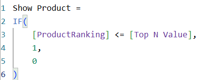

```DAX
Show Product =
IF(
    [ProductRanking] <= [Top N Value],
    1,
    0
)
```

### Previous-month Sales Change

This measure retrieves net sales from the previous month using `DATEADD` and returns the relative change with `DIVIDE`, avoiding a direct division-by-zero error. It responds to the date context supplied by `DimDate`.

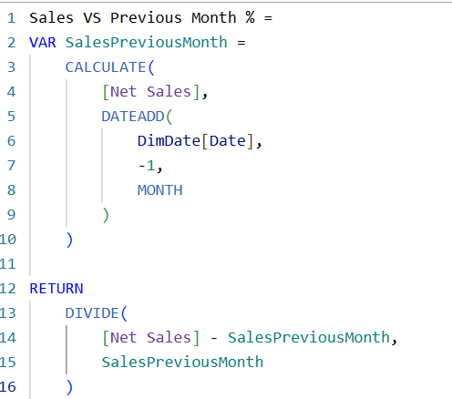

```DAX
Sales VS Previous Month % =
VAR SalesPreviousMonth =
    CALCULATE(
        [Net Sales],
        DATEADD(DimDate[Date], -1, MONTH)
    )
RETURN
    DIVIDE(
        [Net Sales] - SalesPreviousMonth,
        SalesPreviousMonth
    )
```

### Orders by Shipping Date

The active date relationship represents the report's default date context. `Orders Shipped` uses `USERELATIONSHIP` to activate the alternate relationship between `FactSales[ShippedDate]` and `DimDate[Date]`, allowing orders to be analyzed by shipment date instead.

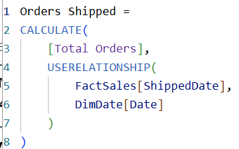

```DAX
Orders Shipped =
CALCULATE(
    [Total Orders],
    USERELATIONSHIP(
        FactSales[ShippedDate],
        DimDate[Date]
    )
)
```

### Sales at Current Product Price

`SalesAtCurrentPrice` iterates over the sales fact table with `SUMX`, retrieves the related current product price from `DimProduct`, applies quantity and discount, and estimates sales at the current catalog price. This is a scenario measure and should not be confused with historical net sales, which use the transaction price stored in the fact table.

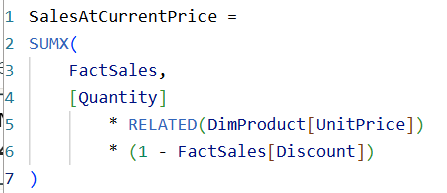

```DAX
SalesAtCurrentPrice =
SUMX(
    FactSales,
    [Quantity]
        * RELATED(DimProduct[UnitPrice])
        * (1 - FactSales[Discount])
)
```

### Product Drillthrough

A dedicated drillthrough page provides detailed product-level analysis while preserving the selected product context.


## Other Interactive Features

- Page-navigation buttons between Products, Employees, and Customers
- Dynamic Top N parameter
- Custom report-page tooltip
- Year and country slicers
- Cross-filtering and cross-highlighting
- Reset-filter buttons
- Conditional formatting
- Category-to-product drill-down
- Context-aware KPI cards


## Row-Level Security

Static row-level security roles were created on `DimEmployee` to represent different employee responsibilities. The screenshot shows roles for a sales manager and individual sales representatives. The selected manager rule filters `EmployeeID` to the permitted set `{5, 6, 7, 9}`; model relationships propagate that security context to the related fact data.

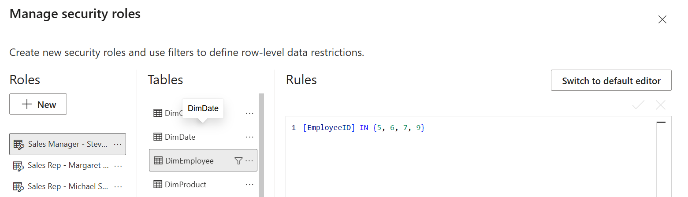

This implementation demonstrates role creation and row filtering in Power BI Desktop. In a production environment, role membership would also need to be assigned and validated in Power BI Service.

## Performance Validation

Power BI Performance Analyzer was used to record visual execution times and identify the relative cost of report elements. In the captured run, the visible objects completed between approximately **133 ms and 371 ms**; the Top 5 Customers visual was the slowest visible item at 371 ms, followed by the Monthly Sales Trend at 257 ms.

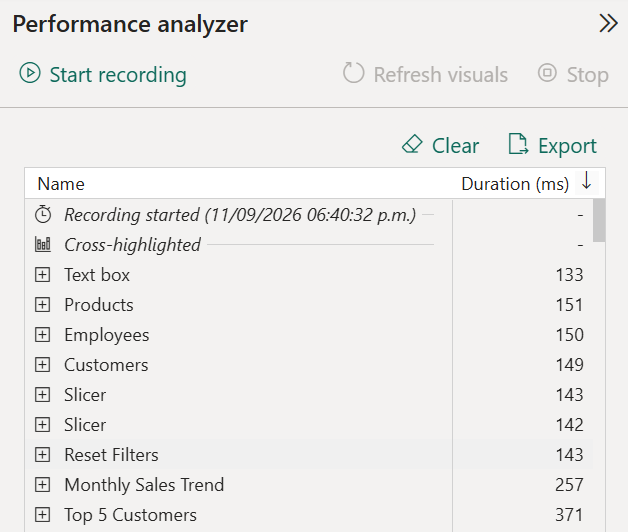

This evidence confirms that report performance was measured rather than assumed. The capture represents one recorded interaction and is not intended as a universal benchmark across devices or environments.

## Key Findings

- Net sales total approximately **$448.4M** across more than **16K orders**.
- **Beverages** is the leading category by net sales in the report, at approximately **$92M**.
- **Côte de Blaye** is the highest-ranked product by net sales, at approximately **$53M**.
- Customer activity is geographically distributed across multiple markets, with the United States showing the largest visible customer count.
- Employee sales are relatively concentrated around the high-$40M to low-$50M range, while order volumes vary more noticeably.
- The model supports separate analysis by order date and shipped date through alternate date relationships.

These findings are descriptive and belong to a sample dataset. They do not establish causal relationships, profitability, or real-world company performance.

## Tools and Skills Demonstrated

- **Power BI Desktop** — report development and interaction design
- **Power Query** — data import, cleaning, merging, typing, and custom columns
- **DAX** — explicit measures, iterator functions, filter context, ranking, Top N logic, time intelligence, and alternate relationships
- **Data modeling** — fact/dimension separation, relationship management, and calendar modeling
- **Visualization** — executive summaries, product/customer/employee analysis, maps, matrices, scatter plots, and conditional formatting
- **Security** — static row-level security roles
- **Optimization** — visual timing with Performance Analyzer

## Repository Structure

```text
Northwind-Sales-Analysis/
├── Northwind-Sales-Analysis.pbix
├── README.md
└── images/
    ├── 01-executive-summary.png
    ├── 02-products-categories.png
    ├── 03-customers-geography.png
    ├── 04-employees-operations.png
    ├── 05-product-drillthrough.png
    ├── 06-drillthrough-action.png
    ├── 07-custom-tooltip.png
    ├── 08-data-model.png
    ├── 09-power-query.png
    ├── 10-dax-customer-share.png
    ├── 11-dax-product-ranking.png
    ├── 12-dax-current-price-sales.png
    ├── 13-dax-previous-month.png
    ├── 14-dax-orders-shipped.png
    ├── 15-dax-top-n-filter.png
    ├── 16-row-level-security.png
    └── 17-performance-analyzer.png
```

## How to Explore the Project

1. Download `Northwind-Sales-Analysis.pbix`.
2. Open it with Power BI Desktop.
3. Use the year and country slicers to change the analysis context.
4. Use the navigation buttons to move between report pages.
5. Change the Top N selection on the Executive Summary.
6. Right-click a product and open the Product Detail drill-through page.
7. Hover over supported visuals to view the custom tooltip.
8. Review the Model view, Power Query steps, DAX measures, and security roles for the technical implementation.

## Limitations

- Northwind is a sample database, not a live production source.
- The dataset does not provide sufficient historical cost information to calculate reliable profit or margin.
- `SalesAtCurrentPrice` is a scenario calculation based on the current catalog price, not a historical-sales measure.
- The RLS example uses static roles for demonstration; production deployment would require user/group assignment in Power BI Service.
- Performance timings depend on the device, cache state, data volume, and report interaction being measured.

## Author

**Lucía Porta**

GitHub: [@luciaporta-ux](https://github.com/luciaporta-ux)

---

*Portfolio project developed to demonstrate practical Power BI and PL-300-aligned data analysis skills.*
